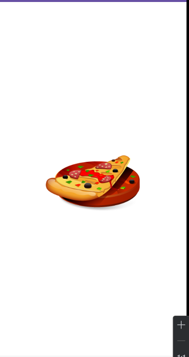
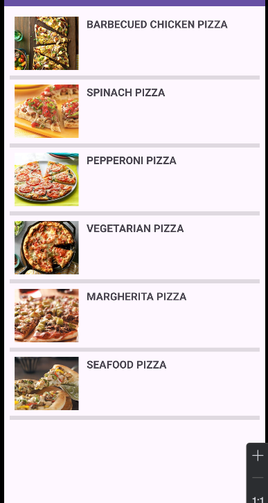
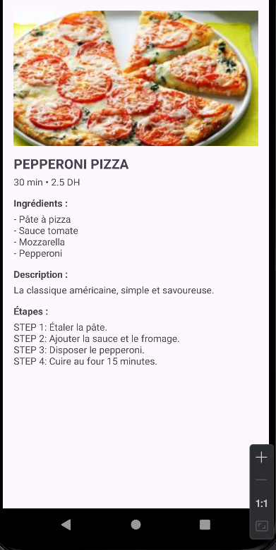

# Lab-Simple-Application-Mobile-de-gestion-de-recettes

Cette application Android, développée en Java, permet d’afficher une liste de pizzas avec leur nom, leur prix, leur durée de préparation et leur image. En cliquant sur une pizza, l’utilisateur peut accéder à une page détaillée contenant les ingrédients, une description et les étapes complètes de la recette. Ce projet permet de comprendre l’organisation d’un projet Android en plusieurs packages (classes, dao, service, adapter, ui), l’utilisation d’une ListView avec un Adapter personnalisé, le passage de données entre activités ainsi que la mise en place d’un Splash Screen et d’un modèle orienté objet.

